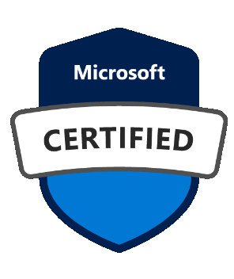

 
 

---

   
 
 

Welcome to the Knowledge Hub for Microsoft Certifications. 

Discover a world of valuable resources and guides to help you navigate the realm of Microsoft certifications. Whether you're a seasoned professional or just starting your journey, this hub is here to support you every step of the way. Here, you'll find the Ultimate Certification Guide, Exam Wiki containing all resources related to the specific exams (work in progress), and information on free exam voucher opportunities.

---
## What are Microsoft Cloud Certifications?

Microsoft Cloud Certification are worldwide recognized certifications that show you have knowledge of different areas of Microsoft Cloud. As any other certifications, you shouldn't be taking them to learn or study new areas, you should learn those areas and certify your knowledge in them because having bunch of certifications but actually having none real-world experience won't provide many benefits to your career or job seeking.

## Why should you get Microsoft Cloud Certifications?

- You will have an advantage over other job seekers who don't have them
- Helps get through the HR filter and makes you more attractive to recruiters
- Microsoft Partner companies receive benefits from Microsoft by employing certified individuals
- Bigger scale projects or government contracts sometimes require employees to be certified in the areas

Read the [Ultimate Certification Guide]([/](https://github.com/teriaavibes/Microsoft-Certification-Knowledge-Hub/tree/main/The%20Ultimate%20Certification%20Guide)) to learn more about the world of Microsoft certifications.

---

### Currently active or upcoming free/discounted exam opportunities

- Microsoft Enteprise Skills Initiative
- _Microsoft Ignite_ (Fall 2023)
